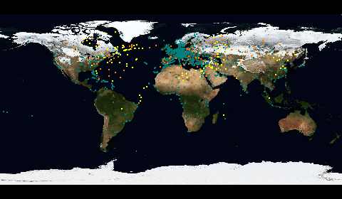

fra-airtraffic Bildschirmschoner
===

Inspiriert durch den Star Alliance Bildschirmschoner, welcher leider bereits vor
Jahren eingestellt worden ist, habe ich beschlossen, meinen eigenen
Flugverkehrs-Bildschirmschoner zu programmieren. Dieser zeigt Fl&uuml;ge von/nach
Frankfurt International Airport auf einem Foto der Erde wie oben dargestellt an.

Einschr&auml;nkungen
---

- Es werden keine echten Routen angezeigt, die dargestellten Pfade sind die
k&uuml;rzesten Distanzen (Gro&szlig;kreise) zwischen Flugh&auml;fen.
- Es werden lediglich geplante Flugdaten angezeigt. Im derzeitigen Softwarestand
werden nur statische Daten (keine aktuellen) benutzt.
- Zwischenstopps werden nicht ber&uuml;cksichtigt.

Geplante Funktionen
-

- T&auml;glich aktualisierte Flugdaten
- Echtzeitanzeige (nicht beschleunigt)
- Tag/Nacht Trennlinie anzeigen
- Farbauswahl

Unters&uuml;tzte Platformen
---

Momentan ist nur eine Version f&uuml;r Microsoft Windows verfügbar. Ein
xscreensaver-Plugin f&uuml;r Linux-Benutzer ist in Arbeit. Nach derzeitigem Stand
ist nicht klar, ob es eine MAC-Version geben wird.

Downloads
---

Siehe [Releases](https://github.com/flederwiesel/fra-airtraffic/releases).
